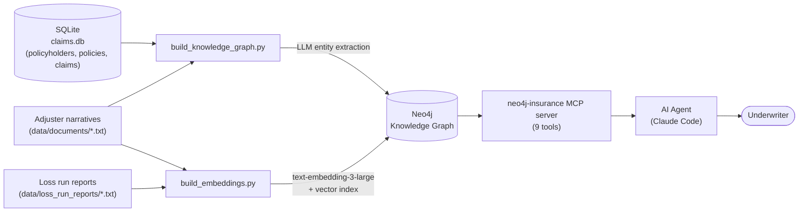

# Neo4j Insurance MCP Server — Hackathon Documentation

## Elevator pitch

An underwriter asks a question in plain English, inside the AI coding agent they already have open — no new app, no new login. Behind the scenes, a local MCP server queries a Neo4j knowledge graph that fuses three normally-siloed data sources: the core policy/claims system of record (SQL), adjuster narrative notes (unstructured text), and formal loss run reports (unstructured text, embedded for semantic search). The agent picks the right tool, the tool queries the graph, and the answer comes back grounded in real data — not a hallucination.

## The problem

A commercial underwriter reviewing an account for renewal today has to:
1. Pull structured claim history from the policy admin system
2. Request a loss run report from the broker (often a multi-day turnaround, sometimes a scanned PDF)
3. Read through adjuster notes for context the structured data doesn't capture
4. Manually cross-reference all three to spot patterns — recurring causes, duplicate-looking claims, concerning trends

Each of those lives in a different system, in a different format, and nothing connects them. Structured BI tools can't read the adjuster's notes. Document search tools can't join back to the claim's financial data. Nothing does both at once.

## The solution

One connected graph, one set of purpose-built tools, zero new UI:

- **Structured data** (SQL source of truth) → policyholders, policies, claims — loaded directly into the graph.
- **Unstructured data** — two distinct genres, both linked into the same graph:
  - Adjuster narratives (one per claim)
  - Loss run reports (one per policyholder, the formal renewal document)
- An **LLM extracts entities** (third parties, witnesses, injuries, assets) from every narrative and links them in.
- Both unstructured sources are **chunked and embedded** (`text-embedding-3-large`) into a Neo4j native vector index — this is the GraphRAG layer that makes semantic (meaning-based, not just keyword) search possible.
- A **local MCP server** exposes 9 tools over this graph. Any MCP-compatible AI agent (Claude Code, in this build) becomes an instant underwriting analyst assistant.

## Architecture



### Graph data model

```
(:PolicyHolder {id, name, industry, since})
(:Policy {policy_number, line_of_business, effective_date, expiry_date, limit_amount, deductible})
(:Claim {claim_id, date_of_loss, status, cause_of_loss, incurred_amount, paid_amount, reserve_amount})
(:Incident {claim_id, date, location, description})
(:Document {doc_id, type, text, source})              -- adjuster narratives
(:LossRunReport {report_id, policyholder_id, text})    -- one per policyholder
(:Entity {name, type})                                  -- extracted via LLM
(:Chunk {chunk_id, text, embedding, source_type,
         policy_number, claim_id, loss_run_report_id})  -- embedded, vector-indexed

(PolicyHolder)-[:HOLDS]->(Policy)-[:HAS_CLAIM]->(Claim)-[:INVOLVES]->(Incident)
(Claim)-[:HAS_DOCUMENT]->(Document)-[:MENTIONS]->(Entity)
(Claim)-[:SIMILAR_TO {score}]-(Claim)
(LossRunReport)-[:FOR_POLICYHOLDER]->(PolicyHolder)
(LossRunReport)-[:FOR_POLICY]->(Policy)
(LossRunReport)-[:COVERS_CLAIM]->(Claim)
(Document|LossRunReport)-[:HAS_CHUNK]->(Chunk)-[:ABOUT_CLAIM]->(Claim)
```

**Current scale**: 8 policyholders, 13 policies, 45 claims, 45 adjuster narratives, 8 loss run reports, 98 embedded chunks, 37 extracted entities, 24 claim-similarity edges.

## Tool catalog

| Tool | What it does | Retrieval style | Real-world use case |
|---|---|---|---|
| `resolve_entity` | Fuzzy-resolves a partial/misspelled name or id to a canonical graph entity | Exact/fuzzy string match | Standard first step in any production enterprise search — names are never typed consistently across systems ("Meridian Mfg" vs. "Meridian Manufacturing Co.") |
| `get_loss_run` | Structured claim history for a policyholder, optionally the N most recent | Structured Cypher | The most-requested document in commercial underwriting — automating it removes the multi-day broker request cycle |
| `get_claim_details` | Merged view: claim fields + linked narrative + extracted entities | Structured + graph join | One claim's full picture without opening three separate systems |
| `search_claims` | Filtered structured search (cause, amount, date range, status) | Structured Cypher | Portfolio-wide risk review — e.g. every Water Damage claim over $50k for reinsurance/cat-modeling input |
| `find_similar_claims` | Graph-based similarity (shared cause + location + timing) | Graph pattern | SIU fraud-ring detection, and genuine risk-engineering signals (a building with a recurring issue needs a loss-control visit) |
| `search_claim_documents` | Exact keyword/phrase fulltext search over narratives | Fulltext index | Compliance/e-discovery — "every claim file mentioning subrogation" or a named contractor under investigation |
| `semantic_search` | **Vector similarity search** over embedded chunks (narratives + loss run reports) | GraphRAG / vector | The differentiator: answers conceptual questions ("any concerning pattern here?") without the user knowing the exact wording used in the source text |
| `get_risk_summary` | Aggregated risk profile: count, total incurred, avg severity, claims/year, top causes | Structured aggregation | Instant renewal risk-appetite decision support instead of a manually-built spreadsheet |
| `get_loss_run_report` | Full text of a policyholder's formal loss run report | Structured + document | The literal renewal-file document, generated instantly instead of waiting on a broker |
| `ingest_claim_document` | Attaches a new document to a claim live, LLM-extracts entities, embeds it | Write + LLM + embedding | An adjuster's new field note is immediately searchable — no batch re-index job, the graph stays live |

A companion **Claude Code skill** (`.claude/skills/neo4j-insurance/SKILL.md`) encodes the routing logic above so the agent picks the right tool (or right combination) automatically instead of the user needing to know which tool answers which question shape.

## Demo Q&A script

All answers below are grounded in the actual seeded graph — verified live, not illustrative.

---

**Q: "Resolve 'Meridian' for me."**
→ `resolve_entity("meridian")`
**Expected:** `PH-001`, "Meridian Manufacturing Co.", industry Manufacturing, confidence 0.8.

---

**Q: "Give me the last 3 claims for Meridian Manufacturing."**
→ `get_loss_run("Meridian", limit=3)`
**Expected:** `total_claim_count: 7`, `returned_count: 3` — CLM-00043 (Fire, 2026-08-03, $61,000, Closed), CLM-00042 (Fire, 2026-05-20, $47,500, Closed), CLM-00003 (Vandalism, 2026-01-14, $15,000, Closed). The tool distinguishes "returned" from "total" so the agent never implies these are the account's only claims.

---

**Q: "What's the risk profile for Meridian Manufacturing?"**
→ `get_risk_summary("Meridian")`
**Expected:** 7 claims, $429,000 total incurred, avg severity ~$61,286, top cause **Fire (5 of 7 claims)** — an immediately visible concentration risk.

---

**Q: "Find claims similar to CLM-00044."**
→ `find_similar_claims("CLM-00044")`
**Expected:** CLM-00045 (Cascade Construction LLC, Ransomware, $52,500 incurred, **similarity score 1.0**). Both are Ransomware claims in Columbus, OH, three days apart — a textbook pattern to flag for review, found automatically by the graph rather than manually noticed.

---

**Q: "Search claim documents for anything about recurring maintenance issues."**
→ `search_claim_documents("recurring maintenance")`
**Expected:** CLM-00033 and CLM-00004 (score 2.262), CLM-00035 (score 1.11) — narratives whose text literally contains "recurring maintenance issue."

---

**Q: "Has any account shown a recurring fire risk pattern?"**
→ `semantic_search("recurring fire damage risk")`
**Expected:** Top matches are Meridian's fire claims (CLM-00042, CLM-00040, CLM-00002, CLM-00043) and the `LRR-PH-001-2026` loss run report — found **purely on meaning**; the phrase "recurring fire damage risk" never appears verbatim in any source document. This is the clearest live demonstration that it's semantic search, not keyword search.

---

**Q: "Pull the loss run report for Meridian."**
→ `get_loss_run_report("Meridian")`
**Expected:** Full text of `LRR-PH-001-2026` — 7 claims, $429,000 incurred, Fire as the dominant cause, matching the risk summary above (proof the two independently-built sources agree).

---

**Q: "Cascade Construction has two ransomware claims three days apart — is that worth flagging?"**
→ `find_similar_claims` + `get_risk_summary` (combined, per the skill's routing logic)
**Expected:** Similarity score 1.0 between CLM-00044/CLM-00045 (as above); risk summary shows Cascade Construction — a *construction* company — has $784,500 total incurred across causes **Ransomware, Business Email Compromise, Data Breach, and Slip and Fall**. A construction firm carrying that much cyber exposure is itself a flag worth surfacing to underwriting, independent of the duplicate-looking pair.

---

**Q: "Add a note to claim CLM-00043: insured confirmed electrical contractor Vance Electric found a faulty breaker panel."**
→ `ingest_claim_document`
**Expected:** A new document is attached to CLM-00043; entities extracted live — `Vance Electric` (THIRD_PARTY), `faulty breaker panel` (ASSET) — and the new text is immediately searchable via `semantic_search` or `search_claim_documents`, no rebuild step required.

---

## Beyond this demo: where this pattern extends

The graph + MCP-tool pattern built here generalizes directly to other high-value insurance use cases that weren't in scope for this build but reuse the same architecture:

- **Fraud ring detection** — extend `find_similar_claims`-style graph traversal to shared third parties/addresses/bank accounts across claims (the `Entity` nodes already extracted are the seed for this)
- **Quote fraud detection** — the same similarity-scoring approach (Neo4j's own published reference pattern) applied to pre-bind quotes instead of post-loss claims
- **Subrogation discovery** — traverse claims → liability determinations → other insurers to surface recoverable-cost opportunities siloed systems miss
- **Correlated catastrophe exposure** — model policies → properties → geographic risk zones → reinsurance treaties to simulate aggregate exposure under a single event
- **Provider/vendor collusion detection** — community detection over the `Entity` (third-party/vendor) graph to catch billing rings

None of these require a new architecture — they're new Cypher patterns and possibly new node types layered onto the same fused graph.
